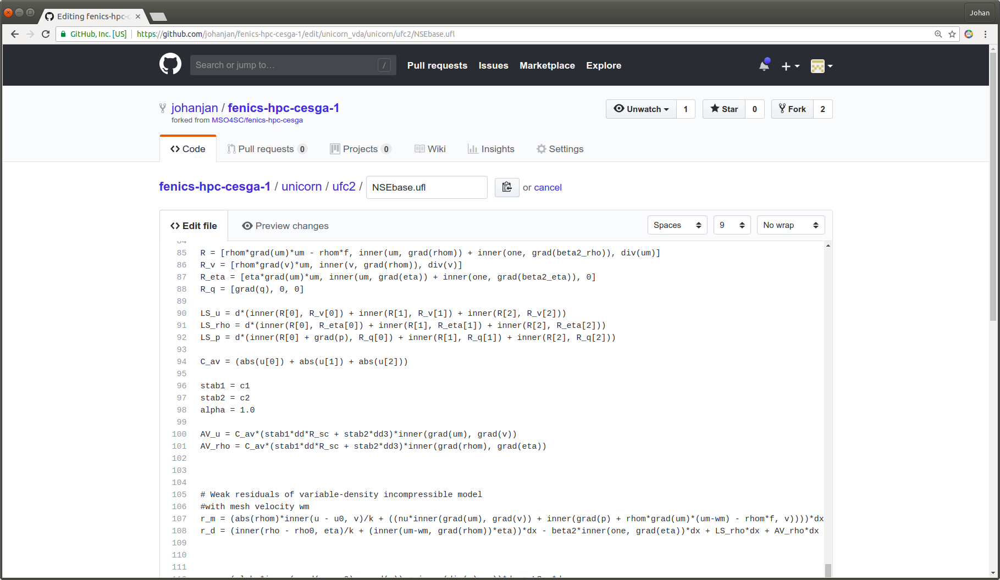
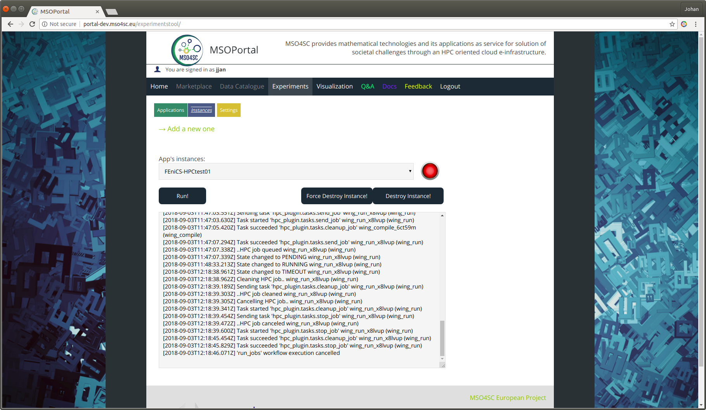
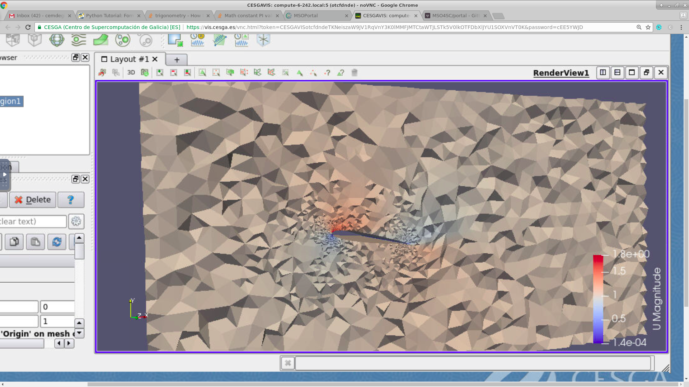

= FEniCS

== Demo MSO4SC Unicorn/FEniCS-HPC Portal workflow with source code web editing

=== Contact:

* Johan Jansson (jjan@kth.se)
* Cem Degirmenci
* Javier Carnero (Portal)

=== Demo workflow

We have successfully tested the following open source
Unicorn/FEniCS-HPC workflow in the MSO4SC Portal with source code web
editing in the GutHub editor. The workflow is specifically of critical
importance for the online course MOOC-HPFEM, and MOOCs in general. By
"user" we mean Portal user and include both someone who simply wants
to edit basic information or data and run simulations, and also a
developer who wants to carry out extensive source code development:

. **Branch repository**
   The user branches or forks the Unicorn/FEniCS-HPC Git repository
   https://bitbucket.org/fenics-hpc/unicorn , "next" branch.

. **Source code web editing**
   The user edits the source code and/or data of her own repository in
   the integrated GitHub web editor:
   

. **Run experiment in Portal on FTII**
   The user runs her own repository version of the experiment in Portal-Experiments on FTII, here the wing
   benchmark, with logging. The repository location is specified in the Experiment form:
   

. **Visualize in Portal**
   The user explores the solution in ParaView the remote desktop Portal-Visualization:   
   

. **Repeat**
   Based on the conclusions from the visualization, the user may want to edit again and restart the workflow.

=== Proposed improvements:

The following proposed improvements should be easily implementable in
the current framework, and should elevate the user experience
significantly:

. GitLab has a more capable web editor.

. The web source code editing and repository forking/branch can be
more integrated in the Portal user interface, for example
automatically forking and opening the web editor, as discussed in
Issue: https://github.com/MSO4SC/MSOPortal/issues/110

. Notification of start/end of the job by email.

. A default visualization can be done by ParaView in batch mode, and emailed to the user.

. Visualization data files can be made available to a data repository
(e.g. Google Drive) and visualized in the Portal using
ParaViewWeb/ParaView Glance.

. Automated MSO4SC run of test experiment on repository commit with
the CI/CD framework in MSO4SC.

