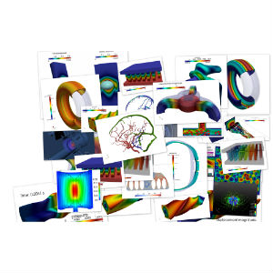

:feelpp: Feel++
= {feelpp}
:cpp: C++

== {feelpp}

{feelpp} is an open-source software gathering scientists, engineers, mathematicians, physicists, medical doctors, computer scientists around applications in academic and industrial projects. {feelpp} is the flag ship framework for interdisciplinary interaction at Cemosis, the agency for mathematics-entreprise and multidisciplinary research in modeling, simulation ad optimisation (MSO) in Strasbourg.
Cemosis is also one of the french link:http://mso.agence-maths-entreprises.fr[MSO] node for mathematics-entreprise interaction.

== {feelpp} Software

{feelpp}  is  a  {cpp}  library  which  provides  a  mathematical  kernel  that  encompasses  a  large  range  of  numerical methods  to  solve  partial  differential  equations  such  as  (i)  arbitrary  order  continuous  and  discontinuous  Galerkin methods  in  1D,  2D  and  3D,  (ii)  domain  decomposition  methods,  (iii)  fictitious  domain  methods,  (iv)  level-set methods or (iv) certified reduced basis methods. These methods are developed and used easily thanks to a domain specific  language  embedded  in  {cpp}  mimicking  the  mathematical  language  associated  to  Galerkin  methods.  This language  allows  physicists,  engineers  and  mathematicians  to  focus  on  the  numerical  methods  as  well  as  on  the physics, whilst hiding the computer science details (e.g. parallelism) or algebraic solvers, thus enabling the user to ramp up very quickly from rapid prototyping numerical methods to large scale computations

== {feelpp} in MSO4SC

The goal of this task is to adapt {feelpp} to the MSO4SC context by:

Software architecture:: ensuring that components well-tested and optimized for the hardware to be used.
Usability:: increasing the readability, as well as providing documentation.
Scriptability::  Providing  ways  to  use  the  {feelpp}  model  components  interactively,  for  example  from  the Python programming language.
Deployability:: to deliver and deploy it in the MSO4SC environment including the parallel(MPI) version.

The  work  on  deployability,  usability  and  scalability  will also be very valuable for researchers. 
